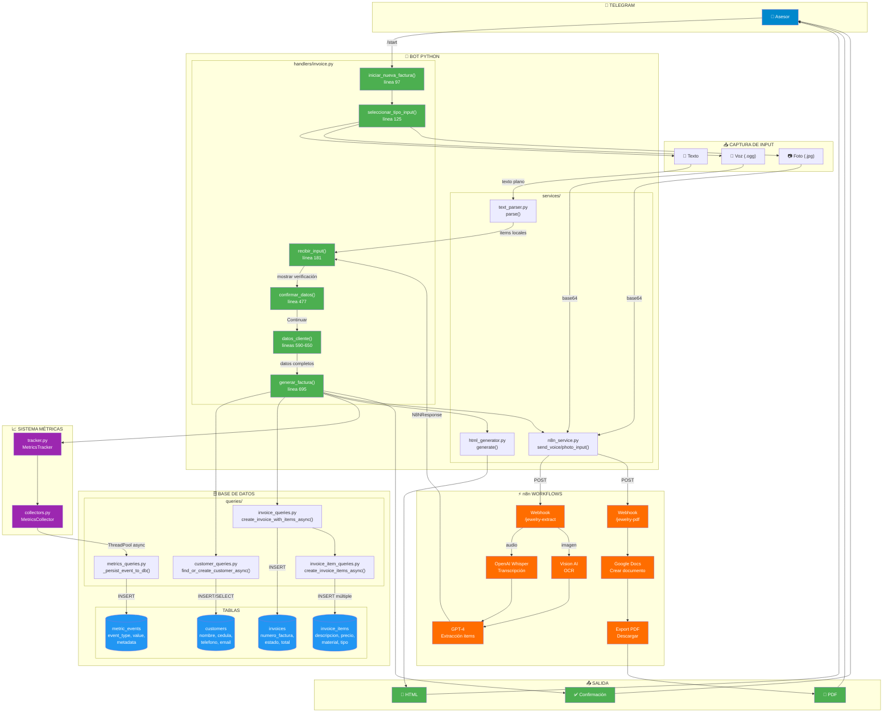
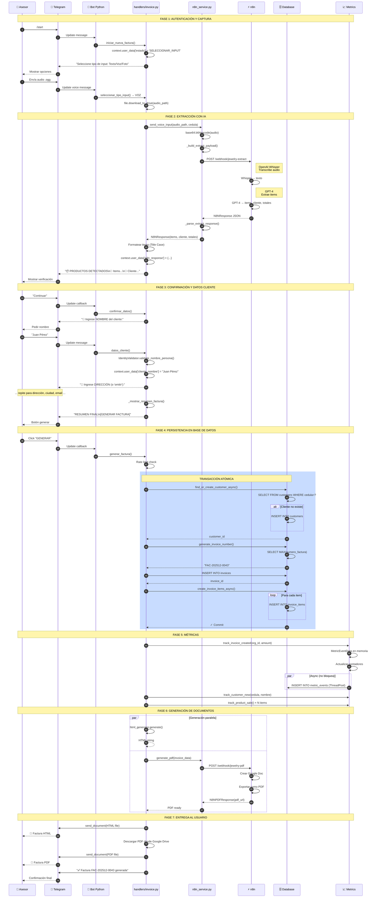
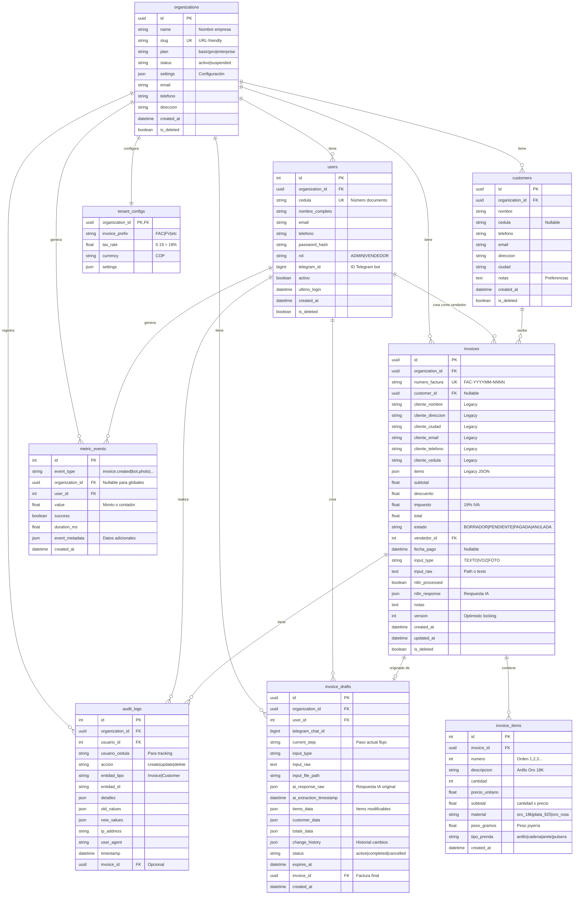
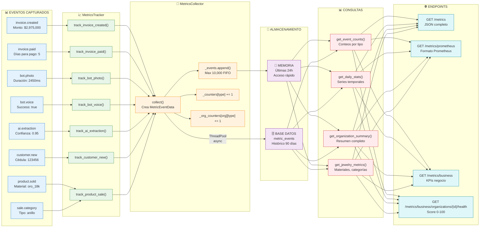
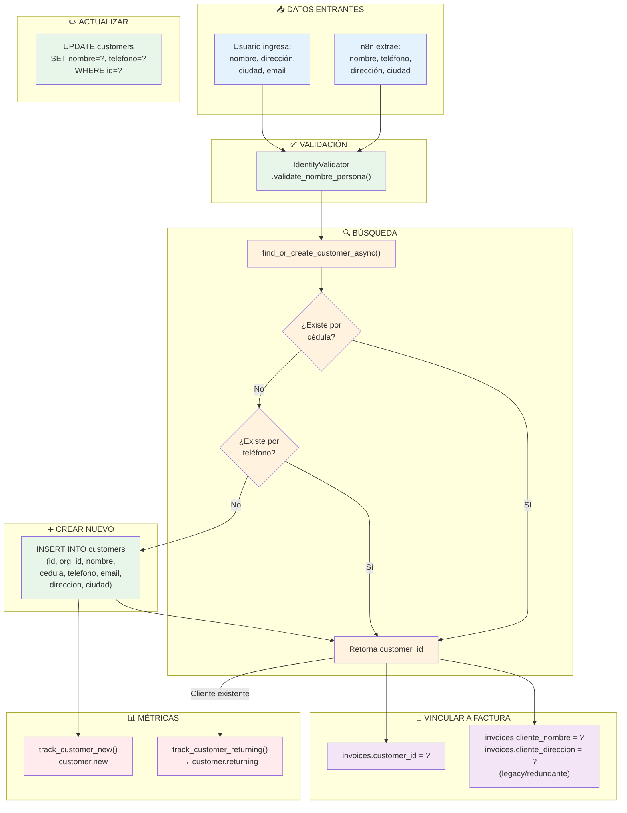

# Mapa Conceptual: Ciclo de Vida de los Datos - Jewelry Invoice Bot

## 📋 Resumen Ejecutivo

Este documento presenta el flujo completo de datos del proyecto, dividido en:
1. **Frontend**: Flujo visible para el usuario (captura → verificación → PDF)
2. **Backend**: Flujo interno (funciones, base de datos, métricas)

---

## 🎨 FRONTEND: Flujo del Usuario

```
┌─────────────────────────────────────────────────────────────────────────────┐
│                           ASESOR (Telegram)                                  │
│  Proporciona: Texto, Audio o Foto con datos de factura                      │
└─────────────────────────────────────────────────────────────────────────────┘
                                    │
                                    ▼
┌─────────────────────────────────────────────────────────────────────────────┐
│                         n8n: EXTRACCIÓN (IA)                                │
│  • Whisper (audio → texto)                                                  │
│  • Vision AI (foto → texto)                                                 │
│  • GPT-4 (texto → items estructurados)                                      │
│  Extrae: Items, Cliente, Totales, Confianza                                 │
└─────────────────────────────────────────────────────────────────────────────┘
                                    │
                                    ▼
┌─────────────────────────────────────────────────────────────────────────────┐
│                      BOT: VERIFICACIÓN                                       │
│  Muestra al usuario:                                                         │
│  • 📦 Productos detectados (nombre, cantidad, precio)                       │
│  • 👤 Cliente detectado (nombre, teléfono, dirección)                       │
│  • 🎤 Transcripción del audio (si aplica)                                   │
│  Opciones: ✅ Continuar | ✏️ Editar | ❌ Cancelar                           │
└─────────────────────────────────────────────────────────────────────────────┘
                                    │
                                    ▼
┌─────────────────────────────────────────────────────────────────────────────┐
│                      n8n: GENERACIÓN PDF                                     │
│  • Recibe datos de factura                                                  │
│  • Crea Google Doc con HTML                                                 │
│  • Exporta como PDF                                                          │
│  Retorna: URL del PDF, base64, filename                                     │
└─────────────────────────────────────────────────────────────────────────────┘
                                    │
                                    ▼
┌─────────────────────────────────────────────────────────────────────────────┐
│                      USUARIO RECIBE                                          │
│  • 📄 Archivo HTML (visualizar en navegador)                                │
│  • 📑 Archivo PDF (descargar/imprimir)                                      │
│  • ✅ Confirmación con número de factura                                    │
└─────────────────────────────────────────────────────────────────────────────┘
```

---

## 🔧 BACKEND: Arquitectura de Datos Detallada

### 1. CAPTURA DE INPUT DEL ASESOR

```
┌──────────────────────────────────────────────────────────────────────────────┐
│  ARCHIVO: src/bot/handlers/invoice.py                                        │
├──────────────────────────────────────────────────────────────────────────────┤
│                                                                              │
│  iniciar_nueva_factura() [línea 97]                                         │
│      │                                                                       │
│      └─► context.user_data['estado'] = 'SELECCIONAR_INPUT'                  │
│                                                                              │
│  seleccionar_tipo_input() [línea 125]                                        │
│      │                                                                       │
│      ├─► InputType.TEXTO → espera mensaje de texto                          │
│      ├─► InputType.VOZ → espera archivo .ogg                                │
│      └─► InputType.FOTO → espera imagen .jpg                                │
│                                                                              │
│  recibir_input() [línea 181]                                                 │
│      │                                                                       │
│      ├─► TEXTO: text = update.message.text                                  │
│      │         TextParserService.parse(text) [LOCAL]                        │
│      │                                                                       │
│      ├─► VOZ:   audio = update.message.voice                                │
│      │         file = await audio.get_file()                                │
│      │         await file.download_to_drive(audio_path)                     │
│      │         n8n_service.send_voice_input(audio_path, cedula)             │
│      │                                                                       │
│      └─► FOTO:  photo = update.message.photo[-1]                            │
│                file = await photo.get_file()                                │
│                await file.download_to_drive(photo_path)                     │
│                n8n_service.send_photo_input(photo_path, cedula)             │
│                                                                              │
└──────────────────────────────────────────────────────────────────────────────┘
                                    │
                                    ▼
┌──────────────────────────────────────────────────────────────────────────────┐
│  ARCHIVO: src/services/n8n_service.py                                        │
├──────────────────────────────────────────────────────────────────────────────┤
│                                                                              │
│  class N8NService:                                                           │
│                                                                              │
│  send_text_input(text, vendedor_cedula, org_id) [línea 79]                  │
│      │                                                                       │
│      └─► _build_extract_payload() → {                                       │
│              "type": "text",                                                │
│              "content": text,                                               │
│              "vendedor_cedula": "123456",                                   │
│              "organization_id": "org-uuid",                                 │
│              "timestamp": "2025-12-31T10:30:00"                             │
│          }                                                                   │
│                                                                              │
│  send_voice_input(audio_path, vendedor_cedula, org_id) [línea 104]          │
│      │                                                                       │
│      ├─► Lee archivo: with open(audio_path, 'rb') as f                      │
│      ├─► Codifica: base64.b64encode(f.read())                               │
│      └─► _build_extract_payload() → {                                       │
│              "type": "voice",                                               │
│              "content": "<base64-audio>",                                   │
│              "content_type": "audio/ogg",                                   │
│              ...                                                            │
│          }                                                                   │
│                                                                              │
│  send_photo_input(photo_path, vendedor_cedula, org_id) [línea 141]          │
│      │                                                                       │
│      ├─► Lee imagen: with open(photo_path, 'rb') as f                       │
│      ├─► Codifica: base64.b64encode(f.read())                               │
│      └─► _build_extract_payload() → {                                       │
│              "type": "photo",                                               │
│              "content": "<base64-image>",                                   │
│              "content_type": "image/jpeg",                                  │
│              ...                                                            │
│          }                                                                   │
│                                                                              │
│  _send_extract_request(payload) [línea 293]                                 │
│      │                                                                       │
│      └─► POST settings.N8N_WEBHOOK_URL/webhook/jewelry-extract              │
│          └─► Headers: Content-Type: application/json                        │
│          └─► Timeout: settings.N8N_TIMEOUT_SECONDS (60s)                    │
│                                                                              │
│  _parse_extract_response(data) [línea 373]                                  │
│      │                                                                       │
│      └─► Retorna N8NResponse:                                               │
│          {                                                                   │
│            "success": true,                                                  │
│            "items": [                                                        │
│              {"numero": 1, "nombre": "Anillo Oro 18K",                      │
│               "cantidad": 1, "precio": 2500000}                             │
│            ],                                                                │
│            "cliente": {"nombre": "Juan", "telefono": "300..."},             │
│            "totales": {"subtotal": 2500000, "impuesto": 475000},            │
│            "transcripcion": "...",                                          │
│            "confianza": 0.95                                                 │
│          }                                                                   │
│                                                                              │
└──────────────────────────────────────────────────────────────────────────────┘
```

---

### 2. ALMACENAMIENTO EN CONTEXTO DEL BOT

```
┌──────────────────────────────────────────────────────────────────────────────┐
│  DATOS EN context.user_data (memoria de sesión Telegram)                     │
├──────────────────────────────────────────────────────────────────────────────┤
│                                                                              │
│  Después de recibir_input() [línea 350-380]:                                 │
│                                                                              │
│  context.user_data = {                                                       │
│      'cedula': '123456789',           # Cédula del vendedor (autenticado)   │
│      'organization_id': 'org-uuid',   # Tenant del vendedor                 │
│      'estado': 'CONFIRMAR_DATOS',     # Estado actual del flujo             │
│      'input_type': 'VOZ',             # Tipo de input usado                 │
│      'input_raw': '/path/to/audio.ogg', # Archivo original                  │
│      'n8n_response': {                                                       │
│          'items': [                                                          │
│              {                                                               │
│                  'numero': 1,                                               │
│                  'nombre': 'Anillo Oro 18K',        # Title Case            │
│                  'descripcion': 'Solitario diamante',                       │
│                  'cantidad': 1,                                             │
│                  'precio': 2500000,                                         │
│                  'total': 2500000                                           │
│              }                                                               │
│          ],                                                                  │
│          'cliente': {                                                        │
│              'nombre': 'Juan Pérez',                # Title Case            │
│              'telefono': '3001234567',                                      │
│              'direccion': 'Calle 123',                                      │
│              'ciudad': 'Bogotá',                                            │
│              'email': 'juan@email.com'                                      │
│          },                                                                  │
│          'totales': {                                                        │
│              'subtotal': 2500000,                                           │
│              'descuento': 0,                                                │
│              'impuesto': 475000,                                            │
│              'total': 2975000                                               │
│          },                                                                  │
│          'transcripcion': 'Un anillo de oro 18 kilates...',                 │
│          'confianza': 0.95                                                  │
│      }                                                                       │
│  }                                                                           │
│                                                                              │
└──────────────────────────────────────────────────────────────────────────────┘
```

---

### 3. FLUJO DE DATOS DEL CLIENTE

```
┌──────────────────────────────────────────────────────────────────────────────┐
│  ARCHIVO: src/bot/handlers/invoice.py                                        │
├──────────────────────────────────────────────────────────────────────────────┤
│                                                                              │
│  confirmar_datos() [línea 477]                                               │
│      │                                                                       │
│      ├─► Si "Continuar": pasa a datos_cliente()                             │
│      └─► Si "Editar": pasa a editar_items()                                 │
│                                                                              │
│  datos_cliente() [línea 590]                                                 │
│      │                                                                       │
│      ├─► Muestra: "📝 Ingrese el NOMBRE del cliente:"                       │
│      └─► Valida: IdentityValidator.validate_nombre_persona(nombre)          │
│                                                                              │
│  cliente_direccion() [línea 614]                                             │
│      │                                                                       │
│      ├─► Guarda: context.user_data['cliente_nombre'] = nombre               │
│      ├─► Muestra: "📍 Ingrese la DIRECCIÓN (o 'omitir'):"                   │
│      └─► Si "omitir": direccion = None                                      │
│                                                                              │
│  cliente_ciudad() [línea 628]                                                │
│      │                                                                       │
│      ├─► Guarda: context.user_data['cliente_direccion'] = direccion         │
│      ├─► Muestra: "🏙️ Ingrese la CIUDAD (o 'omitir'):"                      │
│      └─► Si "omitir": ciudad = None                                         │
│                                                                              │
│  cliente_email() [línea 642]                                                 │
│      │                                                                       │
│      ├─► Guarda: context.user_data['cliente_ciudad'] = ciudad               │
│      ├─► Muestra: "📧 Ingrese el EMAIL (o 'omitir'):"                       │
│      └─► Valida: Formato email válido                                       │
│                                                                              │
│  _mostrar_resumen_factura() [línea 654]                                      │
│      │                                                                       │
│      └─► Construye resumen completo para confirmar:                         │
│          • Cliente (nombre, dirección, ciudad, email)                       │
│          • Productos (cantidad × precio = subtotal)                         │
│          • Impuesto (19%)                                                    │
│          • Total final                                                       │
│                                                                              │
└──────────────────────────────────────────────────────────────────────────────┘
```

---

### 4. PERSISTENCIA EN BASE DE DATOS

```
┌──────────────────────────────────────────────────────────────────────────────┐
│  ARCHIVO: src/bot/handlers/invoice.py                                        │
├──────────────────────────────────────────────────────────────────────────────┤
│                                                                              │
│  generar_factura() [línea 695]                                               │
│      │                                                                       │
│      ├─► Rate limit check (evita spam)                                       │
│      │                                                                       │
│      ├─► Construye invoice_data:                                             │
│      │   {                                                                   │
│      │     "organization_id": "org-uuid",                                   │
│      │     "vendedor_id": user.id,                                          │
│      │     "cliente_nombre": "Juan Pérez",                                  │
│      │     "cliente_direccion": "Calle 123",                                │
│      │     "cliente_ciudad": "Bogotá",                                      │
│      │     "cliente_email": "juan@email.com",                               │
│      │     "items": [...],                                                  │
│      │     "subtotal": 2500000,                                             │
│      │     "impuesto": 475000,                                              │
│      │     "total": 2975000,                                                │
│      │     "estado": "PENDIENTE",                                           │
│      │     "input_type": "VOZ",                                             │
│      │     "n8n_processed": True                                            │
│      │   }                                                                   │
│      │                                                                       │
│      └─► create_invoice(db, invoice_data) [línea 759]                       │
│                                                                              │
└──────────────────────────────────────────────────────────────────────────────┘
                                    │
                                    ▼
┌──────────────────────────────────────────────────────────────────────────────┐
│  ARCHIVO: src/database/queries/invoice_queries.py                            │
├──────────────────────────────────────────────────────────────────────────────┤
│                                                                              │
│  create_invoice_with_items_async(db, invoice_data, items, customer_data)    │
│      │                                                                       │
│      │  TRANSACCIÓN ATÓMICA:                                                │
│      │                                                                       │
│      ├─► 1. BUSCAR/CREAR CLIENTE                                            │
│      │   find_or_create_customer_async(db, org_id, customer_data)           │
│      │       │                                                               │
│      │       ├─► Busca por cedula: SELECT * FROM customers                  │
│      │       │     WHERE cedula = '123' AND organization_id = 'org'         │
│      │       │     AND is_deleted = False                                   │
│      │       │                                                               │
│      │       ├─► Si no existe, busca por teléfono:                          │
│      │       │     SELECT * FROM customers                                  │
│      │       │     WHERE telefono = '300...' AND organization_id = 'org'    │
│      │       │                                                               │
│      │       └─► Si no existe, crea nuevo:                                  │
│      │             INSERT INTO customers                                    │
│      │             (id, organization_id, nombre, cedula, telefono,          │
│      │              email, direccion, ciudad, created_at)                   │
│      │             VALUES (uuid, 'org', 'Juan', '123', '300...',           │
│      │                     'juan@', 'Calle', 'Bogotá', now())              │
│      │                                                                       │
│      ├─► 2. GENERAR NÚMERO DE FACTURA                                       │
│      │   generate_invoice_number(db, org_id)                                │
│      │       │                                                               │
│      │       ├─► SELECT prefix FROM tenant_configs                          │
│      │       │     WHERE organization_id = 'org'                            │
│      │       │     → prefix = 'FAC'                                         │
│      │       │                                                               │
│      │       ├─► SELECT MAX(numero_factura) FROM invoices                   │
│      │       │     WHERE organization_id = 'org'                            │
│      │       │     → último = 'FAC-202512-0042'                             │
│      │       │                                                               │
│      │       └─► Retorna: 'FAC-202512-0043'                                 │
│      │                                                                       │
│      ├─► 3. CREAR FACTURA                                                   │
│      │   INSERT INTO invoices                                               │
│      │   (id, organization_id, numero_factura, customer_id,                 │
│      │    cliente_nombre, cliente_direccion, cliente_ciudad,                │
│      │    cliente_email, items, subtotal, descuento, impuesto,              │
│      │    total, estado, vendedor_id, input_type, input_raw,                │
│      │    n8n_processed, created_at, updated_at)                            │
│      │   VALUES (...)                                                        │
│      │                                                                       │
│      ├─► 4. CREAR ITEMS NORMALIZADOS                                        │
│      │   create_invoice_items_async(db, invoice.id, items)                  │
│      │       │                                                               │
│      │       └─► Para cada item:                                            │
│      │           INSERT INTO invoice_items                                  │
│      │           (id, invoice_id, numero, descripcion, cantidad,            │
│      │            precio_unitario, subtotal, material, peso_gramos,         │
│      │            tipo_prenda, created_at)                                  │
│      │           VALUES (...)                                               │
│      │                                                                       │
│      └─► 5. COMMIT TRANSACCIÓN                                              │
│                                                                              │
└──────────────────────────────────────────────────────────────────────────────┘
```

---

### 5. ESQUEMA DE BASE DE DATOS

```
┌─────────────────────────────────────────────────────────────────────────────────────┐
│                              ESQUEMA DE TABLAS                                       │
├─────────────────────────────────────────────────────────────────────────────────────┤
│                                                                                     │
│  ┌─────────────────────┐     ┌─────────────────────┐     ┌─────────────────────┐   │
│  │    organizations    │     │       users         │     │      customers      │   │
│  ├─────────────────────┤     ├─────────────────────┤     ├─────────────────────┤   │
│  │ id (PK)             │◄────│ organization_id(FK) │     │ id (PK)             │   │
│  │ name                │     │ id (PK)             │     │ organization_id(FK) │───►│
│  │ slug                │     │ cedula              │     │ nombre              │   │
│  │ plan                │     │ nombre_completo     │     │ cedula              │   │
│  │ status              │     │ email               │     │ telefono            │   │
│  │ settings (JSON)     │     │ telefono            │     │ email               │   │
│  │ created_at          │     │ telegram_id         │     │ direccion           │   │
│  │ is_deleted          │     │ rol                 │     │ ciudad              │   │
│  └─────────────────────┘     │ activo              │     │ notas               │   │
│           │                  │ ultimo_login        │     │ created_at          │   │
│           │                  └─────────────────────┘     │ is_deleted          │   │
│           │                           │                  └─────────────────────┘   │
│           │                           │                           │               │
│           ▼                           ▼                           ▼               │
│  ┌─────────────────────────────────────────────────────────────────────────────┐   │
│  │                                invoices                                      │   │
│  ├─────────────────────────────────────────────────────────────────────────────┤   │
│  │ id (PK)                   │ Identificador único UUID                         │   │
│  │ organization_id (FK)      │ Tenant que posee la factura                     │   │
│  │ numero_factura (UNIQUE)   │ FAC-YYYYMM-NNNN formato                         │   │
│  │ customer_id (FK)          │ Cliente normalizado (nuevo)                     │   │
│  │ cliente_nombre            │ Nombre cliente (legacy/redundante)              │   │
│  │ cliente_direccion         │ Dirección cliente                               │   │
│  │ cliente_ciudad            │ Ciudad cliente                                  │   │
│  │ cliente_email             │ Email cliente                                   │   │
│  │ cliente_telefono          │ Teléfono cliente                                │   │
│  │ cliente_cedula            │ Cédula cliente                                  │   │
│  │ items (JSON)              │ Items en JSON (legacy/redundante)               │   │
│  │ subtotal                  │ Suma de items                                   │   │
│  │ descuento                 │ Descuento aplicado                              │   │
│  │ impuesto                  │ IVA 19%                                         │   │
│  │ total                     │ Total a pagar                                   │   │
│  │ estado                    │ BORRADOR|PENDIENTE|PAGADA|ANULADA              │   │
│  │ vendedor_id (FK)          │ Usuario que creó la factura                    │   │
│  │ fecha_pago                │ Cuando se pagó (nullable)                      │   │
│  │ input_type                │ TEXTO|VOZ|FOTO                                  │   │
│  │ input_raw                 │ Input original (path o texto)                   │   │
│  │ n8n_processed             │ Si fue procesado por IA                         │   │
│  │ n8n_response (JSON)       │ Respuesta completa de n8n                       │   │
│  │ notas                     │ Notas adicionales                               │   │
│  │ created_at                │ Fecha creación                                  │   │
│  │ updated_at                │ Fecha última modificación                       │   │
│  │ is_deleted                │ Soft delete flag                                │   │
│  └─────────────────────────────────────────────────────────────────────────────┘   │
│           │                                                                        │
│           │ 1:N                                                                    │
│           ▼                                                                        │
│  ┌─────────────────────────────────────────────────────────────────────────────┐   │
│  │                            invoice_items                                     │   │
│  ├─────────────────────────────────────────────────────────────────────────────┤   │
│  │ id (PK)                   │ Identificador autoincrement                     │   │
│  │ invoice_id (FK)           │ Factura a la que pertenece                      │   │
│  │ numero                    │ Orden del item (1, 2, 3...)                     │   │
│  │ descripcion               │ "Anillo Oro 18K Solitario"                      │   │
│  │ cantidad                  │ Cantidad (≥1)                                   │   │
│  │ precio_unitario           │ Precio por unidad                               │   │
│  │ subtotal                  │ cantidad × precio_unitario                      │   │
│  │ material                  │ oro_18k|plata_925|oro_rosa|etc                 │   │
│  │ peso_gramos               │ Peso en gramos (joyería)                        │   │
│  │ tipo_prenda               │ anillo|cadena|arete|pulsera|etc                │   │
│  │ created_at                │ Fecha creación                                  │   │
│  └─────────────────────────────────────────────────────────────────────────────┘   │
│                                                                                     │
└─────────────────────────────────────────────────────────────────────────────────────┘
```

---

### 6. SISTEMA DE MÉTRICAS

```
┌──────────────────────────────────────────────────────────────────────────────┐
│                    CAPTURA DE MÉTRICAS DE USO DEL BOT                        │
├──────────────────────────────────────────────────────────────────────────────┤
│                                                                              │
│  ARCHIVO: src/metrics/tracker.py (MetricsTracker)                            │
│                                                                              │
│  ┌────────────────────────────────────────────────────────────────────────┐  │
│  │                     EVENTOS QUE SE CAPTURAN                            │  │
│  ├────────────────────────────────────────────────────────────────────────┤  │
│  │                                                                        │  │
│  │  FACTURAS:                                                             │  │
│  │  ├─► track_invoice_created(org_id, amount, user_id)                   │  │
│  │  │     └─► EVENT: invoice.created                                     │  │
│  │  │         metadata: {"amount": 2975000}                              │  │
│  │  │                                                                     │  │
│  │  ├─► track_invoice_paid(org_id, amount, invoice_id, time_to_payment)  │  │
│  │  │     └─► EVENT: invoice.paid                                        │  │
│  │  │         metadata: {"invoice_id": "...", "days_to_pay": 5}          │  │
│  │  │                                                                     │  │
│  │  └─► track_invoice_status_changed(org_id, invoice_id, old, new)       │  │
│  │        └─► EVENT: invoice.status_changed                              │  │
│  │            metadata: {"old_status": "PENDIENTE", "new_status": "PAGADA"}│  │
│  │                                                                        │  │
│  │  BOT:                                                                  │  │
│  │  ├─► track_bot_command(org_id, user_id, command, duration_ms)         │  │
│  │  │     └─► EVENT: bot.command                                         │  │
│  │  │         metadata: {"command": "/start"}                            │  │
│  │  │                                                                     │  │
│  │  ├─► track_bot_photo(org_id, user_id, success, duration_ms)           │  │
│  │  │     └─► EVENT: bot.photo                                           │  │
│  │  │         success: true/false, duration_ms: 2450                     │  │
│  │  │                                                                     │  │
│  │  ├─► track_bot_voice(org_id, user_id, success, duration_ms)           │  │
│  │  │     └─► EVENT: bot.voice                                           │  │
│  │  │                                                                     │  │
│  │  └─► track_bot_error(org_id, user_id, error_type, error_message)      │  │
│  │        └─► EVENT: bot.error                                           │  │
│  │            metadata: {"error_type": "validation", "message": "..."}   │  │
│  │                                                                        │  │
│  │  IA/EXTRACCIÓN:                                                        │  │
│  │  └─► track_ai_extraction(org_id, user_id, type, success,              │  │
│  │  │                        duration_ms, items_count, confidence)       │  │
│  │  │     ├─► EVENT: ai.extraction                                       │  │
│  │  │     ├─► EVENT: ai.extraction.success (si success=true)             │  │
│  │  │     └─► EVENT: ai.extraction.failed (si success=false)             │  │
│  │  │         metadata: {"extraction_type": "photo",                     │  │
│  │  │                    "items_extracted": 3, "confidence": 0.95}       │  │
│  │                                                                        │  │
│  │  CLIENTES:                                                             │  │
│  │  ├─► track_customer_new(org_id, cedula, nombre, user_id)              │  │
│  │  │     └─► EVENT: customer.new                                        │  │
│  │  │         metadata: {"cedula": "123...", "nombre": "Juan"}           │  │
│  │  │                                                                     │  │
│  │  └─► track_customer_returning(org_id, customer_id, user_id)           │  │
│  │        └─► EVENT: customer.returning                                  │  │
│  │                                                                        │  │
│  │  PRODUCTOS/VENTAS:                                                     │  │
│  │  ├─► track_product_sale(org_id, user_id, descripcion, cantidad,       │  │
│  │  │                       precio, material, tipo_prenda, peso)         │  │
│  │  │     ├─► EVENT: product.sold                                        │  │
│  │  │     ├─► EVENT: sale.material (agrupado por material)               │  │
│  │  │     └─► EVENT: sale.category (agrupado por tipo_prenda)            │  │
│  │  │         metadata: {"descripcion": "Anillo Oro 18K",                │  │
│  │  │                    "cantidad": 1, "precio": 2500000,               │  │
│  │  │                    "material": "oro_18k", "tipo_prenda": "anillo"} │  │
│  │  │                                                                     │  │
│  │  └─► track_full_sale(org_id, user_id, customer_data, items, total)    │  │
│  │        └─► Dispara múltiples eventos: customer + products + completed │  │
│  │                                                                        │  │
│  └────────────────────────────────────────────────────────────────────────┘  │
│                                                                              │
└──────────────────────────────────────────────────────────────────────────────┘
                                    │
                                    ▼
┌──────────────────────────────────────────────────────────────────────────────┐
│  ARCHIVO: src/metrics/collectors.py (MetricsCollector)                       │
├──────────────────────────────────────────────────────────────────────────────┤
│                                                                              │
│  collect(event_type, organization_id, user_id, value, success,              │
│          duration_ms, metadata) [línea 150]                                  │
│      │                                                                       │
│      ├─► 1. CREAR EVENTO EN MEMORIA                                         │
│      │   MetricEventData(                                                    │
│      │       event_type="invoice.created",                                  │
│      │       timestamp=datetime.utcnow(),                                   │
│      │       organization_id="org-uuid",                                    │
│      │       user_id=1,                                                     │
│      │       value=2975000.0,                                               │
│      │       success=True,                                                  │
│      │       duration_ms=245.5,                                             │
│      │       metadata={"amount": 2975000}                                   │
│      │   )                                                                   │
│      │                                                                       │
│      ├─► 2. AGREGAR A LISTA EN MEMORIA                                      │
│      │   self._events.append(event)                                         │
│      │   # Max 10,000 eventos (FIFO)                                        │
│      │   # Retención: 24 horas                                              │
│      │                                                                       │
│      ├─► 3. ACTUALIZAR CONTADORES                                           │
│      │   self._counters[event_type] += 1                                    │
│      │   self._org_counters[org_id][event_type] += 1                        │
│      │                                                                       │
│      └─► 4. PERSISTIR EN BD (ASYNC, NO BLOQUEA)                             │
│          loop.run_in_executor(                                              │
│              _db_executor,  # ThreadPoolExecutor(2)                         │
│              _persist_event_to_db,                                          │
│              event_type, org_id, user_id, value, success,                   │
│              duration_ms, metadata                                          │
│          )                                                                   │
│                                                                              │
└──────────────────────────────────────────────────────────────────────────────┘
                                    │
                                    ▼
┌──────────────────────────────────────────────────────────────────────────────┐
│  ARCHIVO: src/database/queries/metrics_queries.py                            │
├──────────────────────────────────────────────────────────────────────────────┤
│                                                                              │
│  _persist_event_to_db(...) [ejecutado en ThreadPool]                        │
│      │                                                                       │
│      └─► INSERT INTO metric_events                                          │
│          (event_type, organization_id, user_id, value, success,             │
│           duration_ms, event_metadata, created_at)                          │
│          VALUES                                                              │
│          ('invoice.created', 'org-uuid', 1, 2975000.0, true,               │
│           245.5, '{"amount": 2975000}', '2025-12-31 10:30:00')             │
│                                                                              │
└──────────────────────────────────────────────────────────────────────────────┘
```

---

### 7. TABLA metric_events

```
┌─────────────────────────────────────────────────────────────────────────────────────┐
│                              metric_events                                           │
├─────────────────────────────────────────────────────────────────────────────────────┤
│                                                                                     │
│  id               │ Integer (PK, autoincrement)                                     │
│  event_type       │ String(50) - INDEXED                                            │
│                   │   Valores: invoice.created, invoice.paid, bot.photo,            │
│                   │            bot.voice, ai.extraction, customer.new,              │
│                   │            product.sold, sale.material, sale.category           │
│                   │                                                                 │
│  organization_id  │ String(36) FK → organizations.id - INDEXED                     │
│                   │   Permite métricas globales (NULL) o por tenant                 │
│                   │                                                                 │
│  user_id          │ Integer FK → users.id                                           │
│                   │   Usuario que generó el evento                                  │
│                   │                                                                 │
│  value            │ Float (default 0.0)                                             │
│                   │   Valor numérico del evento:                                    │
│                   │   - Para facturas: monto total                                  │
│                   │   - Para productos: precio × cantidad                           │
│                   │   - Para contadores: 1.0                                        │
│                   │                                                                 │
│  success          │ Boolean (default True)                                          │
│                   │   Si la operación fue exitosa                                   │
│                   │                                                                 │
│  duration_ms      │ Float (nullable)                                                │
│                   │   Tiempo de ejecución en milisegundos                           │
│                   │                                                                 │
│  event_metadata   │ JSON                                                            │
│                   │   Datos adicionales específicos del evento:                     │
│                   │   - invoice.created: {"amount": 2975000}                        │
│                   │   - bot.photo: {"file_size": 102400}                            │
│                   │   - ai.extraction: {"type": "photo", "confidence": 0.95}        │
│                   │   - product.sold: {"material": "oro_18k", "peso": 5.2}          │
│                   │                                                                 │
│  created_at       │ DateTime - INDEXED                                              │
│                   │   Timestamp UTC del evento                                      │
│                   │                                                                 │
├─────────────────────────────────────────────────────────────────────────────────────┤
│  ÍNDICES COMPUESTOS:                                                                │
│  ├─► ix_metrics_org_type (organization_id, event_type)                             │
│  ├─► ix_metrics_org_date (organization_id, created_at)                             │
│  ├─► ix_metrics_type_date (event_type, created_at)                                 │
│  └─► ix_metrics_org_type_date (organization_id, event_type, created_at)            │
│                                                                                     │
└─────────────────────────────────────────────────────────────────────────────────────┘
```

---

### 8. CONSULTAS DE MÉTRICAS

```
┌──────────────────────────────────────────────────────────────────────────────┐
│  ARCHIVO: src/database/queries/metrics_queries.py                            │
├──────────────────────────────────────────────────────────────────────────────┤
│                                                                              │
│  FUNCIONES DISPONIBLES:                                                      │
│                                                                              │
│  get_event_counts(db, organization_id, since) → Dict                        │
│      │                                                                       │
│      └─► SELECT event_type,                                                 │
│                 COUNT(*) as count,                                          │
│                 SUM(value) as total_value,                                  │
│                 AVG(CASE WHEN success THEN 1 ELSE 0 END) as success_rate    │
│          FROM metric_events                                                 │
│          WHERE organization_id = 'org' AND created_at >= since              │
│          GROUP BY event_type                                                │
│                                                                              │
│  get_daily_stats(db, organization_id, event_type, days) → List              │
│      │                                                                       │
│      └─► SELECT DATE(created_at) as date,                                   │
│                 COUNT(*) as count,                                          │
│                 SUM(value) as total                                         │
│          FROM metric_events                                                 │
│          WHERE organization_id = 'org'                                      │
│            AND event_type = 'invoice.created'                               │
│            AND created_at >= NOW() - INTERVAL days DAY                      │
│          GROUP BY DATE(created_at)                                          │
│          ORDER BY date                                                      │
│                                                                              │
│  get_organization_summary(db, organization_id, since) → Dict                │
│      │                                                                       │
│      └─► Retorna:                                                           │
│          {                                                                   │
│            "invoices": {                                                    │
│              "created": 45,                                                 │
│              "paid": 38,                                                    │
│              "total_amount": 125000000,                                     │
│              "avg_amount": 3289473                                          │
│            },                                                                │
│            "bot": {                                                          │
│              "photos": 89,                                                  │
│              "voices": 34,                                                  │
│              "commands": 156,                                               │
│              "photo_success_rate": 0.95                                     │
│            },                                                                │
│            "ai": {                                                           │
│              "extractions": 123,                                            │
│              "success_rate": 0.92,                                          │
│              "avg_confidence": 0.87                                         │
│            },                                                                │
│            "customers": {                                                    │
│              "new": 28,                                                     │
│              "returning": 17                                                │
│            },                                                                │
│            "products": {                                                     │
│              "sold": 156,                                                   │
│              "by_material": {                                               │
│                "oro_18k": 45,                                               │
│                "plata_925": 67,                                             │
│                "oro_rosa": 23                                               │
│              },                                                              │
│              "by_category": {                                               │
│                "anillo": 56,                                                │
│                "cadena": 34,                                                │
│                "arete": 28                                                  │
│              }                                                               │
│            }                                                                 │
│          }                                                                   │
│                                                                              │
│  cleanup_old_events(db, retention_days=90)                                  │
│      │                                                                       │
│      └─► DELETE FROM metric_events                                          │
│          WHERE created_at < NOW() - INTERVAL retention_days DAY             │
│                                                                              │
└──────────────────────────────────────────────────────────────────────────────┘
```

---

## 📊 REPRESENTACIÓN ALTERNATIVA: DIAGRAMA DE FLUJO VERTICAL

```
                         ┌─────────────────┐
                         │   ASESOR        │
                         │  (Telegram)     │
                         └────────┬────────┘
                                  │
                    ┌─────────────┼─────────────┐
                    │             │             │
                    ▼             ▼             ▼
              ┌──────────┐ ┌──────────┐ ┌──────────┐
              │  TEXTO   │ │   VOZ    │ │   FOTO   │
              └────┬─────┘ └────┬─────┘ └────┬─────┘
                   │            │            │
                   ▼            ▼            ▼
              ┌──────────┐ ┌──────────┐ ┌──────────┐
              │ Local    │ │ Whisper  │ │ Vision   │
              │ Parser   │ │ (n8n)    │ │ AI (n8n) │
              └────┬─────┘ └────┬─────┘ └────┬─────┘
                   │            │            │
                   └─────────────┼────────────┘
                                 │
                                 ▼
                    ┌────────────────────────┐
                    │    GPT-4 EXTRAE:       │
                    │  • Items (productos)   │
                    │  • Cliente (datos)     │
                    │  • Totales (cálculos)  │
                    └───────────┬────────────┘
                                │
                                ▼
                    ┌────────────────────────┐
                    │   BOT MUESTRA PARA     │
                    │     VERIFICACIÓN       │
                    │  [Continuar] [Editar]  │
                    └───────────┬────────────┘
                                │
              ┌─────────────────┼─────────────────┐
              ▼                 │                 ▼
        ┌──────────┐            │           ┌──────────┐
        │ EDITAR   │            │           │ CONFIRMAR│
        │ ITEMS    │            │           │ DATOS    │
        └────┬─────┘            │           └────┬─────┘
             │                  │                │
             └──────────────────┼────────────────┘
                                │
                                ▼
                    ┌────────────────────────┐
                    │   CAPTURA CLIENTE      │
                    │  • Nombre (obligatorio)│
                    │  • Dirección (opcional)│
                    │  • Ciudad (opcional)   │
                    │  • Email (opcional)    │
                    └───────────┬────────────┘
                                │
                                ▼
                    ┌────────────────────────┐
                    │   RESUMEN FINAL        │
                    │    [GENERAR]           │
                    └───────────┬────────────┘
                                │
              ┌─────────────────┼─────────────────┐
              ▼                 │                 ▼
    ┌──────────────────┐        │        ┌──────────────────┐
    │   BASE DE DATOS  │        │        │   n8n WEBHOOK    │
    │                  │        │        │   /jewelry-pdf   │
    │ • customers      │        │        │                  │
    │ • invoices       │        │        │ • Genera HTML    │
    │ • invoice_items  │        │        │ • Crea Google Doc│
    │ • metric_events  │        │        │ • Exporta PDF    │
    └──────────────────┘        │        └────────┬─────────┘
                                │                 │
                                ▼                 ▼
                    ┌────────────────────────────────────┐
                    │         USUARIO RECIBE             │
                    │  📄 HTML + 📑 PDF + ✅ Confirmación │
                    └────────────────────────────────────┘
```

---

---

# 📊 DIAGRAMAS MERMAID.JS

## 1. DIAGRAMA DE FLUJO BACKEND COMPLETO



---

## 2. DIAGRAMA DE SECUENCIA TEMPORAL



---

## 3. DIAGRAMA ENTIDAD-RELACIÓN (ER)



---

## 4. FLUJO DE MÉTRICAS DETALLADO



---

## 5. FLUJO DE DATOS CLIENTE (NORMALIZACIÓN)



---

## 📁 ARCHIVOS CLAVE REFERENCIADOS

| Archivo | Líneas Clave | Responsabilidad |
|---------|--------------|-----------------|
| `src/bot/handlers/invoice.py` | 97, 181, 477, 695 | Orquestación del flujo |
| `src/services/n8n_service.py` | 79, 104, 141, 293 | Comunicación con n8n |
| `src/database/models.py` | 150-400 | Modelos SQLAlchemy |
| `src/database/queries/invoice_queries.py` | * | CRUD facturas |
| `src/database/queries/customer_queries.py` | * | CRUD clientes |
| `src/database/queries/metrics_queries.py` | * | Métricas y analytics |
| `src/metrics/tracker.py` | * | Tracking de eventos |
| `src/metrics/collectors.py` | 150, 354 | Persistencia métricas |
